<!-- hero: ASCII-art avatar portrait (left - Pillow grayscale/contrast/gamma
     density mapping of the live GitHub avatar, typewriter row-by-row
     reveal) beside the 3D extruded ASCII wordmark (right - rocks gently on
     its vertical axis via SMIL flipbook). GitHub's  sandbox runs SMIL
     and CSS animation-on-load fine, just never JS.
     regenerate: python scripts/fetch_avatar.py && python scripts/render_photo_ascii.py
                 python scripts/make_wordmark_svg.py --out wordmark.svg -->

<h3><code>nikhil@github ~ $ whoami</code></h3>

<table>
<tr>
<td valign="top"></td>
<td width="24"></td>
<td valign="top"></td>
</tr>
</table>

 
 

<!-- contribution heatmap: real data, boxes reveal on load
     (regenerated daily by .github/workflows/update-profile-art.yml) -->

<h3><code>nikhil@github ~ $ ./contributions.sh</code></h3>

 
 

<h3><code>nikhil@github ~ $ ./links.sh</code></h3>

<b>ML Engineer · Multi-Agent AI Systems</b>

 

